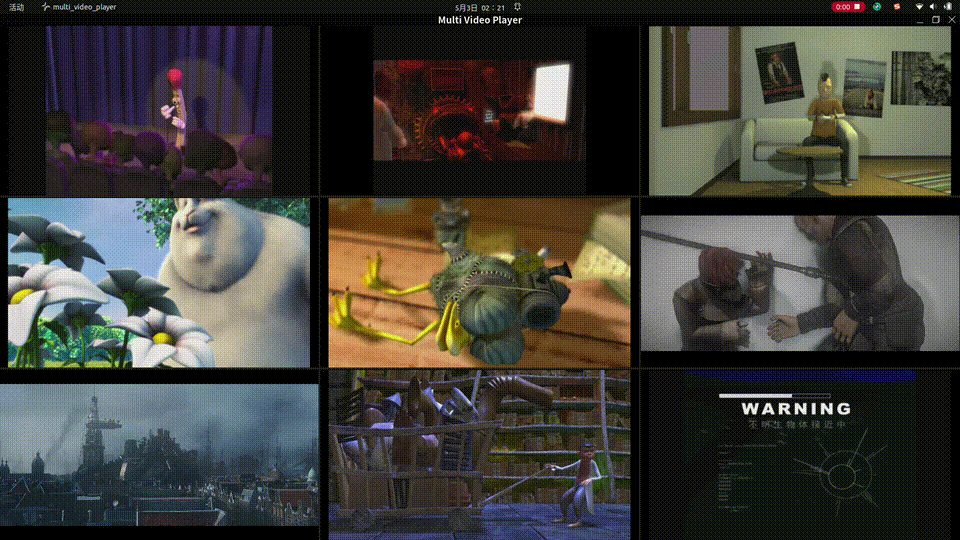

# Multi Video Player

A multi-video player based on VAAPI hardware decoding and EGL DMA-BUF zero-copy rendering. All videos are composited into a single window with a grid layout.

> This project's code is AI-generated, written using OpenCode + DeepSeek V4 Pro.

## Features

- **Single-window Grid Layout** — multiple videos displayed in one window, automatically arranged as 2×1 / 2×2 / 3×2, etc.
- **VAAPI Hardware Decoding** — H.264 / HEVC GPU decoding (requires Intel/AMD VAAPI driver)
- **DMA-BUF Zero-copy** — decoded frames imported directly into EGL via DRM PRIME fds, no CPU copy
- **CPU Software Fallback** — unsupported codecs (e.g., MPEG4) automatically fall back to FFmpeg software decoding
- **Dual Texture Strategy** — each player independently maintains DMA-BUF and CPU texture sets, switched on demand
- **No Flicker** — vsync-driven render loop; when no new frame arrives, re-render from existing textures without black/green artifacts
- **PulseAudio Output** — independent audio stream per video

## System Requirements

- Linux (Wayland desktop environment)
- Intel / AMD GPU with VAAPI support
- CMake 3.16+, C++17

## Dependencies

```bash
sudo apt install \
    libwayland-dev libwayland-egl-dev libegl-dev libgles-dev \
    libva-dev libva-drm2 libdrm-dev \
    libavcodec-dev libavformat-dev libavutil-dev libswresample-dev \
    libdecor-0-dev \
    libpulse-dev \
    wayland-protocols pkg-config
```

## Build

```bash
mkdir build && cd build
cmake ..
make -j$(nproc)
```

## Usage

```bash
./multi_video_player <video1> [video2] [video3] ...
```

Examples:

```bash
# Play a single video (1×1)
./multi_video_player video.mp4

# Play two videos simultaneously (2×1 grid)
./multi_video_player video1.mp4 video2.mp4

# Four videos (2×2 grid)
./multi_video_player v1.mp4 v2.mp4 v3.mp4 v4.mp4

# Mix hardware and software decoding
./multi_video_player hevc_hardware.mp4 old_mpeg4.avi
```

### Demo



## Architecture

```
┌─────────────────────────────────────────────────────┐
│                   Main (single thread)               │
│  ┌──────────┐                                       │
│  │ Wayland  │  wl_display → libdecor decorated      │
│  │  Window  │  window                                │
│  └────┬─────┘                                       │
│       │                                              │
│  ┌────┴─────┐                                       │
│  │   EGL     │  single EGLContext + EGLSurface       │
│  │ Renderer  │  ┌─────────┐ ┌─────────┐             │
│  │           │  │ p0 tex  │ │ p1 tex  │  ...        │
│  │           │  │ Y + UV  │ │ Y + UV  │             │
│  │           │  └─────────┘ └─────────┘             │
│  └────┬─────┘                                       │
│       │                                              │
│  ┌────┴─────┐  PlayerWindow[] (one per video)       │
│  │ Decoder  │  ┌──────────────┐                      │
│  │ Threads  │  │ VaapiDecoder │ DMA-BUF export       │
│  │          │  └──────────────┘                      │
│  └──────────┘                                       │
│                                                      │
│  Render loop:                                        │
│    beginFrame() → per-cell render → drawBorders()    │
│    → scheduleFrame → swapBuffers → awaitFrame        │
└─────────────────────────────────────────────────────┘
```

### Data Flow

```
video file → av_read_frame → avcodec_send_packet
                                ↓
              ┌─ VAAPI HW decode → AV_PIX_FMT_VAAPI
              │   vaExportSurfaceHandle → DMA-BUF fd
              │   eglCreateImage → glEGLImageTargetTexture2DOES
              │   → NV12 shader render
              │
              └─ (fallback) SW decode → AV_PIX_FMT_YUV420P
                  upload to GL luminance textures
                  → YUV420P shader render
```

### Render Pipeline

```
for each cell in grid:
  glScissor(cell) → glClear(black)
  glViewport(letterboxed region)
    if new DMA-BUF frame:   createEGLImages + renderQuadDmaBuf
    elif new CPU frame:     upload CPU textures + renderYuv420p
    elif last was DMA-BUF:  renderDmaBufToRectPrev (reuse textures)
    elif last was CPU:      renderCpuFrameToRectPrev (reuse textures)

drawBorders() via glScissor + glClear(dark gray)
scheduleFrame() → eglSwapBuffers() → awaitFrame()
```

## Module Overview

| Module | Role |
|--------|------|
| `main.cpp` | Grid layout, render loop, cell border drawing |
| `wayland_window` | libdecor window management, frame callback vsync sync |
| `vaapi_decoder` | FFmpeg + VAAPI decoding, DMA-BUF export, CPU fallback |
| `egl_renderer` | EGL/GLES2 rendering, EGLImage DMA-BUF import, NV12/YUV420P shaders |
| `player_window` | Decoder wrapper, frame buffer (DMA-BUF + CPU dual path) |
| `audio_output` | PulseAudio simple API audio playback |

## Environment Verification

```bash
vainfo                          # Check VAAPI driver support
ls /dev/dri/renderD*            # Check DRM render nodes
echo $XDG_SESSION_TYPE          # Confirm Wayland environment
```

## License

MIT
